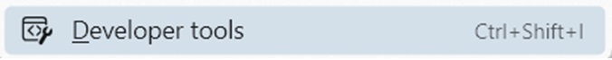

# Trace Azure Authentication
## Developer Tools

Open the Developer Tools

- Clear Browser Cache: Ctrl-Shift-Delete

- Open Browser Dev Tools: Ctrl-Shift-I or Right click - Inspect

- Select the Network Tab in Dev Tools

Check the Preserve log check box in the settings menu bar

Right click the header row and select URL to to display the column

Status Column 302 redirect

Name Column callback

Payload tab Form Data

Select Token id and navigate to https://JWT.io JSON Web Token decoder
	

## Test

